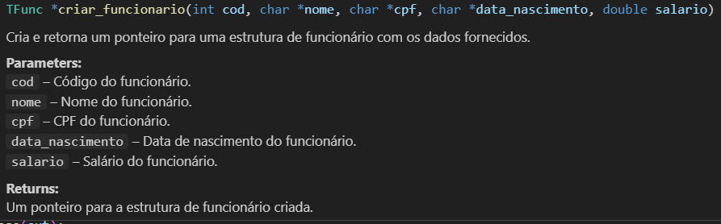

# Data Structures & Algorithms II

This repository is intended for students studying **Algorithms and Data Structures II**, offering a practical approach to manipulating files in secondary memory using the C language. As an example, we developed an application for managing a library.

#### Latest Documentation Update: `14/12/2023`

## summary

1. [Requirements](#Requirements)
2. [How to Use/Install](#use)
3. [Project Details - Logical Part](#source)
4. [Contribution](#contribution)

## Requirements

To successfully implement this project, you need the following technologies and tools configured:

- **Programming Language:** [C] - The project was developed exclusively in C.

- **Database:** [Custom Database] - Uses a custom database stored in binary files in the 'bin' folder.


- **Compiler:** [Minimalist GNU for Windows] - Developed using MinGW as compiler. We recommend [installing](https://terminalroot.com.br/2022/12/como-instalar-gcc-gpp-mingw-no-windows.html) MinGW or GCC to ensure adequate performance and avoid bugs, as the fixes are based on specific compiler commands.

- **Operating System:** [Windows] - Exclusively compatible with Windows due to the use of the *<windows.h>* graphics library.

## Uses

### Common Usage

To get started using the Library Management System, follow these steps:

1. Compile the source code directly via bat (inside the repository directory):

```shell windows 
.\compile.bat
```
2. This will compile all .c files in the directory, then run the main program using the following command:
````shell windows
./window.exe
````
### Own/Modified Use

If you want to make modifications to the project so that it only works via the terminal, I recommend that you follow these steps to avoid bugs:

1. Create your *main* file inside `unit_tests/main.c`;

2. After making all the desired modifications to your program, compile:
```shell windows 
gcc -o main ./src/*.c ... /pasta_x/*.c

```
3. This will compile all .c files in the directories, then run the main program using the following command:
````shell windows
./main.exe
````

4. (You can also change compile.bat to make the repetitive process easier)

**Note** If there are bugs in the compilation, you can delete all window handling files and folders, namely:
- `./windows_main.c`
- `./src/window_functions`

## Source

In this section, we will cover how codes work

Don't worry, in the `./src` folder, you will find everything documented in the headers, happy reading!




#### General observations:

- Each script is independent and contains its own specific windows and functionality.
- Careful handling of files and validation of user input are important considerations, and their implementations are in `/src/estruturas.c`
- Scripts can be compiled separately, and their functionality can be integrated as needed.


## Contribution

We are open to contributions and improvements to this project. If you want to contribute or suggest improvements, feel free to open issues, submit pull requests, and collaborate on development.
